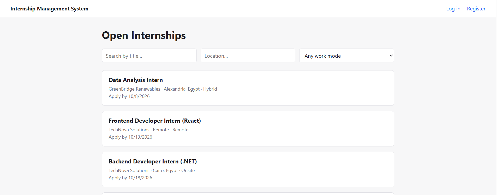
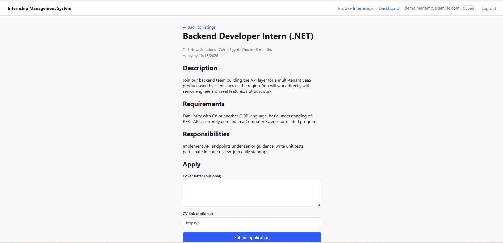
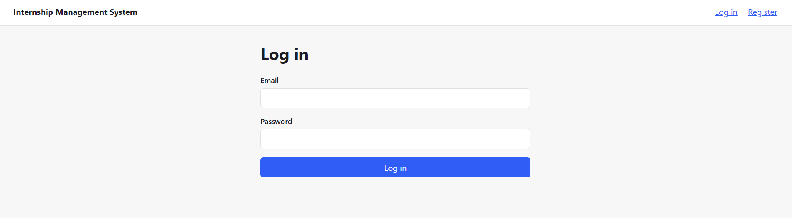
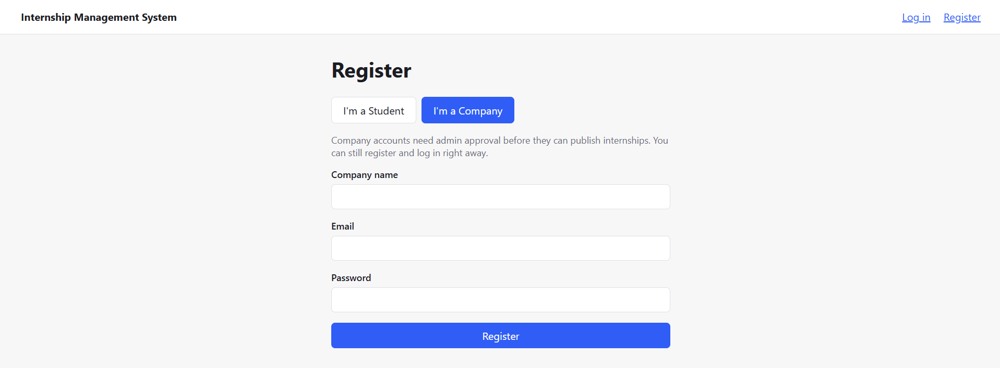
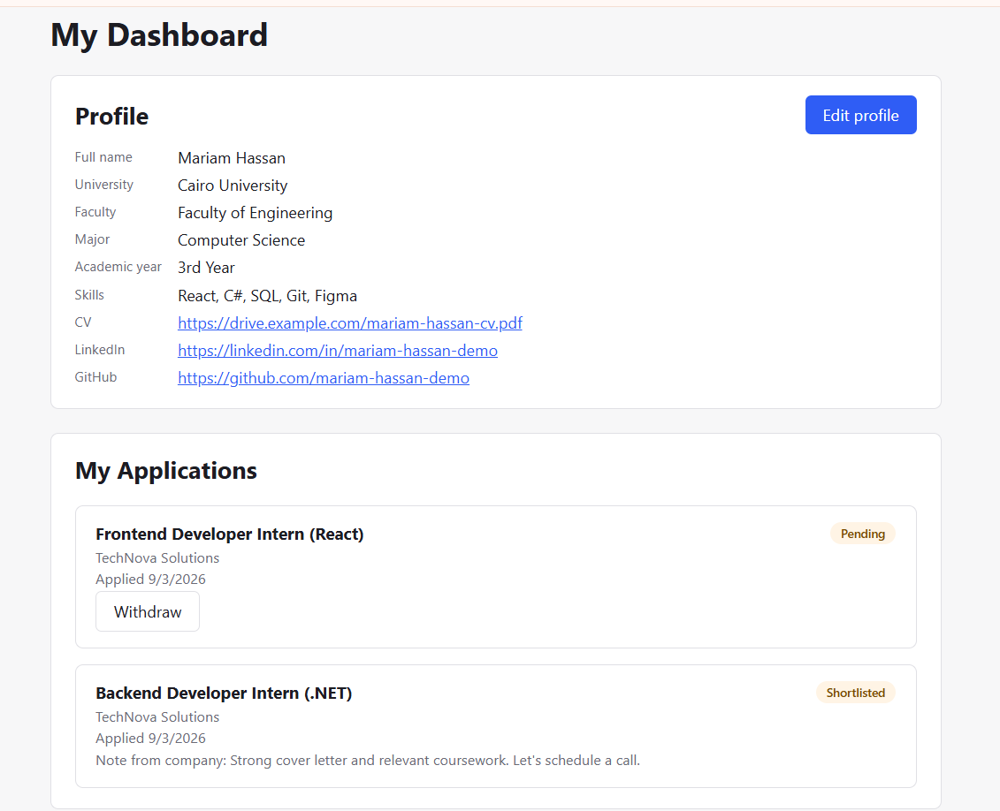
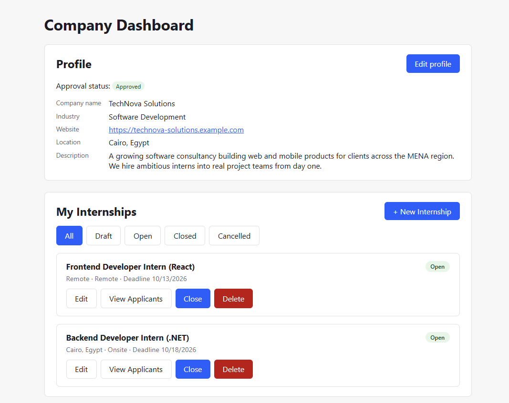
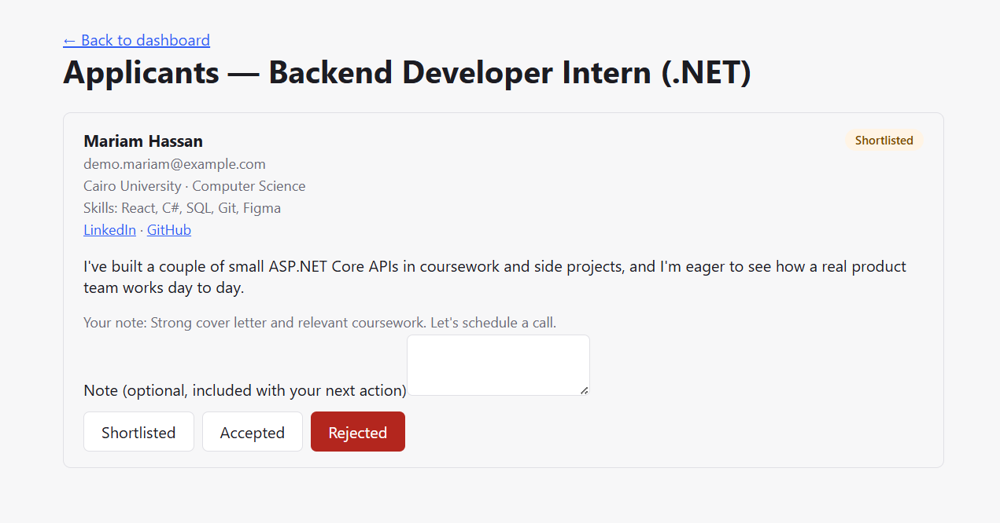
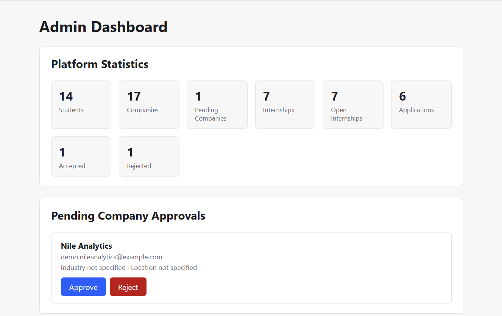
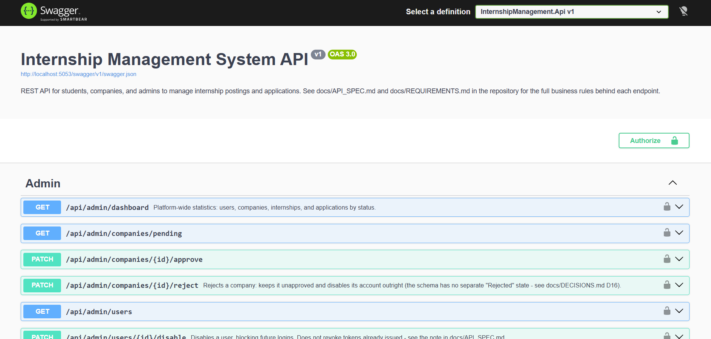

# Internship Management System

A full-stack web application where **students** apply for internships, **companies**
publish and manage internship posts, and **admins** approve companies and monitor the
platform — built phase by phase (18 phases, documented end to end) as a learning and
portfolio project.

**Status:** feature-complete and tested locally — backend, frontend, Docker, and an
automated test suite are all done and working. Public deployment is configured
(`render.yaml`, see [Deployment](#deployment)) but not yet live. See
[docs/PHASES.md](docs/PHASES.md) for the full roadmap this was built against.

## Overview

The system models a realistic internship workflow with real business rules (company
approval, application deadlines, no-duplicate-applications, ownership checks) rather
than plain CRUD — company registers → admin approves → company publishes an internship
→ student applies → company reviews → everyone sees the outcome. It's built with a
strong emphasis on being able to explain *why* every part is built the way it is, not
just that it works — see [docs/DECISIONS.md](docs/DECISIONS.md) for 22 documented
design decisions and their rejected alternatives.

- **Scope & requirements:** [docs/PROJECT_SCOPE.md](docs/PROJECT_SCOPE.md) ·
  [docs/REQUIREMENTS.md](docs/REQUIREMENTS.md)
- **Roadmap:** [docs/PHASES.md](docs/PHASES.md)
- **Key decisions:** [docs/DECISIONS.md](docs/DECISIONS.md)
- **Full build log:** [docs/phase-summaries/](docs/phase-summaries/) — one detailed
  handover document per phase

## Features

- Role-based auth (Student / Company / Admin) with a custom JWT implementation
- Student and Company profiles, each managed by their own owner
- Admin approval workflow — companies can't publish until an admin approves them
- Internship publishing workflow (Draft → Open → Closed), with ownership and
  business-rule checks (approval required, deadline in the future, etc.)
- Public internship listing with pagination, location/work-mode filtering, and title search
- Student application workflow — apply, track status, withdraw (while still Pending)
- Company application review — shortlist / accept / reject, with notes
- Admin dashboard — platform statistics, pending-company approvals, user management
- Role-based dashboards and protected routes in the React frontend
- Consistent error handling across the entire API (RFC 9457 Problem Details)
- 55 automated tests (xUnit) covering the core business rules
- One-command local run via Docker Compose; public deployment configured for Render

## User Roles

| Role | Can do |
|---|---|
| **Student** | Manage profile, browse open internships, apply, track & withdraw applications |
| **Company** | Manage profile, publish internships (once approved), review applicants |
| **Admin** | Approve/reject companies, view users/applications, disable users, view stats |

## Tech Stack

| Layer | Technology |
|---|---|
| Backend | C# / .NET 10, ASP.NET Core Web API, Entity Framework Core |
| Database | PostgreSQL |
| Auth | Custom JWT (System.IdentityModel.Tokens.Jwt) + BCrypt password hashing |
| Frontend | React 19 + TypeScript, Vite, React Router |
| Testing | xUnit, EF Core InMemory provider |
| Containerization | Docker, Docker Compose, nginx (reverse proxy + static hosting) |
| Deployment | Render (Blueprint / Infrastructure-as-Code via `render.yaml`) |
| Tooling | Git, Swagger/OpenAPI (Swashbuckle) |

## Architecture

Layered backend (Controllers → Services → EF Core), a thin React frontend organized by
route and by role, and two different deployment topologies for local vs. public use.
Full write-up, request-lifecycle diagram, and project layout:
[docs/ARCHITECTURE.md](docs/ARCHITECTURE.md).

## Database Design

Documented in [docs/DATABASE_DESIGN.md](docs/DATABASE_DESIGN.md), including the ERD and
the `(StudentId, InternshipPostId)` unique constraint that prevents duplicate
applications at the database level, not just in application code.

## API Documentation

Interactive Swagger UI is available whenever the backend is running, at `/swagger`.
Full endpoint reference, request/response shapes, and the unified error format:
[docs/API_SPEC.md](docs/API_SPEC.md).

## Screenshots

| Public listing | Internship detail & apply |
|---|---|
|  |  |

| Login | Register |
|---|---|
|  |  |

| Student dashboard | Company dashboard |
|---|---|
|  |  |

| Applicant review | Admin dashboard |
|---|---|
|  |  |

| Swagger UI |
|---|
|  |

## Getting Started

**Prerequisites:** .NET 10 SDK, Node.js 20+, PostgreSQL running locally.

```bash
git clone https://github.com/yousef-wasefy/Internship_Management_System.git
cd Internship_Management_System
```

**Backend:**
```bash
cd backend/src/InternshipManagement.Api
dotnet user-secrets set "ConnectionStrings:DefaultConnection" "Host=localhost;Port=5432;Database=internship_management;Username=<your-db-user>;Password=<your-db-password>"
dotnet user-secrets set "Jwt:Key" "<a-long-random-string>"
dotnet run --launch-profile http
```
The database schema is created automatically on first run (EF Core migrations apply at
startup — no manual `dotnet ef database update` needed). Swagger opens at
`http://localhost:5053/swagger`. A seeded admin account
(`admin@internship-system.local` / `Admin@12345`) is created automatically — change
this before using the project for anything beyond local development.

**Frontend** (in a second terminal):
```bash
cd frontend
npm install
npm run dev
```
Open `http://localhost:5173`.

## Running with Docker

The whole system — Postgres, backend, frontend — runs with one command:
```bash
cp .env.example .env   # then fill in real values
docker compose up --build
```
Frontend: `http://localhost:8081`. Backend Swagger: `http://localhost:5053/swagger`.
See [docs/DECISIONS.md](docs/DECISIONS.md) D21 for how this topology (nginx
reverse-proxying the API) differs from local development and from the Render deployment.

## Running Tests

```bash
cd backend
dotnet test tests/InternshipManagement.Tests
```
55 tests covering the core business rules (company approval gating, the internship
publishing workflow, application ownership and status rules, admin actions) run against
an in-memory database — no Postgres connection needed. See
[docs/DECISIONS.md](docs/DECISIONS.md) D20 for what's deliberately out of scope for
these tests and why.

## Environment Variables

Local development uses [.NET User Secrets](https://learn.microsoft.com/en-us/aspnet/core/security/app-secrets)
(never committed) for the connection string and JWT key. Docker Compose and Render both
read the same values from environment variables instead — see
[.env.example](.env.example) for the Docker Compose variables and
[docs/DEPLOYMENT.md](docs/DEPLOYMENT.md) for Render's.

## Main Business Rules

See [docs/REQUIREMENTS.md](docs/REQUIREMENTS.md#4-core-business-rules).

## Deployment

A Render Blueprint (`render.yaml`) is ready to deploy the whole system — Postgres,
backend, and frontend — as three connected services. **Not yet deployed live** (this
step needs a Render account, which only the project owner can create). Full
step-by-step instructions, including known free-tier limitations: [docs/DEPLOYMENT.md](docs/DEPLOYMENT.md).

## What I Learned

See the running [docs/LEARNING_LOG.md](docs/LEARNING_LOG.md) — new concepts, real
mistakes and how they were found, and interview-ready explanations, logged after every
phase. For a curated study guide drawn from all of it, see
[docs/INTERVIEW_PREP.md](docs/INTERVIEW_PREP.md).

## Future Improvements

Email notifications, CV file upload, advanced search, saved internships, company ratings,
interview scheduling, admin audit logs, analytics dashboard, AI-based recommendations,
real-time notifications — all deliberately deferred beyond Version 1 (see
[docs/PROJECT_SCOPE.md](docs/PROJECT_SCOPE.md#out-of-scope-version-1--deliberately-excluded)).
