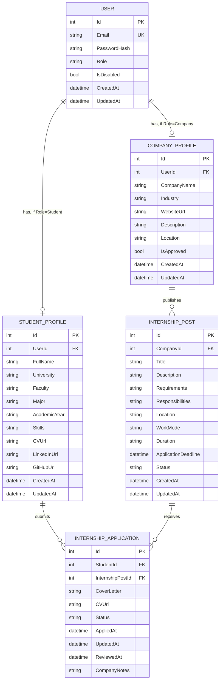

# Database Design

This document is the **paper design** of the database — finalized before any EF Core code
is written (that happens in Phase 4). It defines the entities, their fields, relationships,
and constraints, and explains *why* each important decision was made.

## 1. Overview

Five tables cover the whole MVP:

```text
User                    — login credentials + role (shared by all three roles)
StudentProfile          — student-specific data (1–1 with a Student user)
CompanyProfile          — company-specific data (1–1 with a Company user)
InternshipPost          — an internship opportunity (published by a company)
InternshipApplication   — the join between a student and an internship they applied to
```

No table is included that isn't needed for a Version 1 requirement in
`docs/REQUIREMENTS.md`. There is no `AdminProfile`, no separate `Skill` table, and no file
storage table — see [§7 Design Decisions](#7-design-decisions) for why.

## 2. Entity-Relationship Diagram (ERD)



> GitHub renders Mermaid diagrams natively — open this file on GitHub (or in VS Code with
> a Mermaid preview extension) to see it as a real diagram, not just code.

## 3. Entities

Field types below are conceptual (string / int / bool / datetime / enum) — the exact C#
and PostgreSQL types are decided when the entity classes are written in Phase 4.

### 3.1 `User`

The shared identity table for all three roles. Kept **separate** from the profile tables
(see D9) so that authentication data (email, password, role) never mixes with
role-specific profile data.

| Field | Type | Constraints | Notes |
|---|---|---|---|
| `Id` | int | PK, identity | |
| `Email` | string | **Unique**, required | The login identifier |
| `PasswordHash` | string | required | A BCrypt hash — the raw password is never stored (D2) |
| `Role` | enum `UserRole` | required | `Student` / `Company` / `Admin`, set once at registration; drives authorization in Phase 6 |
| `IsDisabled` | bool | default `false` | Set to `true` by an admin (REQUIREMENTS.md AD-5); disabled users must be blocked from logging in (Phase 11) |
| `CreatedAt` | datetime | required | |
| `UpdatedAt` | datetime | required | |

### 3.2 `StudentProfile`

| Field | Type | Constraints | Notes |
|---|---|---|---|
| `Id` | int | PK, identity | |
| `UserId` | int | FK → `User.Id`, **Unique**, required | The unique constraint is what makes this relationship 1–1 instead of 1–many |
| `FullName` | string | required | |
| `University` | string | optional | |
| `Faculty` | string | optional | |
| `Major` | string | optional | |
| `AcademicYear` | string | optional | Free text (e.g. `"3rd Year"`) rather than a structured level — simplest option for v1 |
| `Skills` | string | optional | Comma-separated free text (see D10) |
| `CVUrl` | string | optional | A link (e.g. Google Drive) — no file upload in v1, that's out of scope |
| `LinkedInUrl` | string | optional | |
| `GitHubUrl` | string | optional | |
| `CreatedAt` | datetime | required | |
| `UpdatedAt` | datetime | required | |

Most fields besides `FullName` are optional because a profile row is created automatically
at registration with minimal data, then filled in later through the "complete profile"
endpoint (Phase 7).

### 3.3 `CompanyProfile`

| Field | Type | Constraints | Notes |
|---|---|---|---|
| `Id` | int | PK, identity | |
| `UserId` | int | FK → `User.Id`, **Unique**, required | Enforces 1–1, same pattern as `StudentProfile` |
| `CompanyName` | string | required | |
| `Industry` | string | optional | |
| `WebsiteUrl` | string | optional | |
| `Description` | string | optional | |
| `Location` | string | optional | |
| `IsApproved` | bool | default `false` | Companies start unapproved (REQUIREMENTS.md CO-3); an admin flips this in Phase 11 |
| `CreatedAt` | datetime | required | |
| `UpdatedAt` | datetime | required | |

### 3.4 `InternshipPost`

| Field | Type | Constraints | Notes |
|---|---|---|---|
| `Id` | int | PK, identity | |
| `CompanyId` | int | FK → `CompanyProfile.Id`, required | Every post belongs to exactly one company |
| `Title` | string | required | |
| `Description` | string | optional | |
| `Requirements` | string | optional | |
| `Responsibilities` | string | optional | |
| `Location` | string | optional | |
| `WorkMode` | enum `WorkMode` | required | `Onsite` / `Remote` / `Hybrid` |
| `Duration` | string | optional | Free text (e.g. `"3 months"`) rather than structured start/end dates — simplest option for v1 |
| `ApplicationDeadline` | datetime | required | Enforced against `DateTime.Now` when a student applies (Phase 9) and when a company opens the post (Phase 8) |
| `Status` | enum `InternshipStatus` | default `Draft` | `Draft` / `Open` / `Closed` / `Cancelled` — see REQUIREMENTS.md §5 |
| `CreatedAt` | datetime | required | |
| `UpdatedAt` | datetime | required | |

### 3.5 `InternshipApplication`

The **join table** connecting a `StudentProfile` to an `InternshipPost` — see
[§5 Relationships](#5-relationships) for what that means. This is the table with the most
business rules riding on it.

| Field | Type | Constraints | Notes |
|---|---|---|---|
| `Id` | int | PK, identity | |
| `StudentId` | int | FK → `StudentProfile.Id`, required | Part of the composite unique constraint below |
| `InternshipPostId` | int | FK → `InternshipPost.Id`, required | Part of the composite unique constraint below |
| `CoverLetter` | string | optional | |
| `CVUrl` | string | optional | Lets a student attach a different CV per application than their profile default |
| `Status` | enum `ApplicationStatus` | default `Pending` | `Pending` / `Shortlisted` / `Accepted` / `Rejected` / `Withdrawn` |
| `AppliedAt` | datetime | required | Set once, when the row is created |
| `UpdatedAt` | datetime | required | |
| `ReviewedAt` | datetime | nullable | Set when a company changes the status away from `Pending` (Phase 10) |
| `CompanyNotes` | string | nullable | Optional internal note a company can leave on an application |
| **`(StudentId, InternshipPostId)`** | — | **Unique (composite)** | **The single most important constraint in this schema** — see §6 |

## 4. Enums

| Enum | Values |
|---|---|
| `UserRole` | `Student`, `Company`, `Admin` |
| `WorkMode` | `Onsite`, `Remote`, `Hybrid` |
| `InternshipStatus` | `Draft`, `Open`, `Closed`, `Cancelled` |
| `ApplicationStatus` | `Pending`, `Shortlisted`, `Accepted`, `Rejected`, `Withdrawn` |

Enums are used instead of free-text status columns so the database and the C# compiler
both reject invalid values (e.g. a typo'd `"Pendign"`) — this was practiced hands-on in
Phase 2.

## 5. Relationships

| Relationship | Cardinality | How it's enforced |
|---|---|---|
| `User` → `StudentProfile` | 1 to (0 or 1) | `StudentProfile.UserId` is a unique FK; only present if `User.Role == Student` |
| `User` → `CompanyProfile` | 1 to (0 or 1) | `CompanyProfile.UserId` is a unique FK; only present if `User.Role == Company` |
| `CompanyProfile` → `InternshipPost` | 1 to many | `InternshipPost.CompanyId` FK (not unique — a company can have many posts) |
| `StudentProfile` → `InternshipApplication` | 1 to many | `InternshipApplication.StudentId` FK |
| `InternshipPost` → `InternshipApplication` | 1 to many | `InternshipApplication.InternshipPostId` FK |
| `StudentProfile` ↔ `InternshipPost` | many to many | **Realized through** `InternshipApplication` |

**What "realized through a join table" means:** a student can apply to many internships,
and an internship can receive many students' applications — a direct many-to-many
relationship. Instead of a bare link table with just two foreign keys, `InternshipApplication`
is a **join table with its own extra columns** (`Status`, `CoverLetter`, `AppliedAt`, ...)
because each application *itself* has data worth storing, not just the fact that a link
exists. This is the same "many-to-many through a table" pattern named in
`docs/PHASES.md` Phase 3's learning outcomes.

## 6. Constraints

### Primary keys
Every table has an `Id` (int, auto-increment) primary key — see D8 for why `int` instead
of `Guid`.

### Foreign keys
Every FK listed in §3 enforces **referential integrity**: you cannot insert an
`InternshipPost` with a `CompanyId` that doesn't exist in `CompanyProfile`, and so on.
Exact delete behavior (e.g. what happens to a company's posts if the company is deleted)
is a Phase 4 EF Core configuration detail, not a paper-design concern.

### Unique constraints
- `User.Email` — no two accounts can share an email (needed for login to be unambiguous).
- `StudentProfile.UserId` / `CompanyProfile.UserId` — enforces the 1–1 relationship with `User`.
- **`InternshipApplication.(StudentId, InternshipPostId)`** — a **composite unique
  constraint** (unique on the *pair* of columns together, not each column alone). This is
  the database-level enforcement of REQUIREMENTS.md rule **4.1.4: "a student cannot apply
  twice to the same internship."** It means a student can have many applications (to
  different internships) and an internship can receive many applications (from different
  students), but the exact same `(StudentId, InternshipPostId)` pair can only exist once.

This constraint matters because it's **enforced by the database itself**, not just
application code — even if a bug or a race condition let two "apply" requests through the
service layer at the same instant, the database would reject the second insert. Phase 9
will pair this with a friendly application-level check first (so the user gets a clear
error message instead of a raw database error).

## 7. Design Decisions

These schema-specific choices are also logged in the central `docs/DECISIONS.md`
(D8–D10):

- **D8 — `int` identity primary keys, not `Guid`.** Simpler to read and type while testing
  in Swagger (`GET /internships/3` vs. a GUID string), and this project has no
  multi-database-merge scenario that would need globally unique IDs.
- **D9 — `User` is separate from `StudentProfile`/`CompanyProfile`, and there is no
  `AdminProfile`.** Keeps authentication data isolated from profile data instead of one
  wide table full of nulls (a Company row would have no `FullName`, a Student row would
  have no `CompanyName`, etc.). Admins have no extra fields in the requirements, so they
  are just a `User` with `Role = Admin` and no profile table at all.
- **D10 — `Skills` is a single comma-separated string, not a normalized `Skill` table.**
  A proper many-to-many `Skill`/`StudentSkill` table would be the "more correct" relational
  design, but it's unnecessary complexity for v1 search/filtering needs. Matches the
  project rule to avoid over-engineering the MVP. Documented as a candidate under
  **Future Improvements** in the README if it's ever needed.

## 8. Deliberately Deferred

Not modeled in this schema, on purpose (matches `docs/PROJECT_SCOPE.md` out-of-scope list):
- A normalized `Skill` table (see D10)
- File storage for CVs (only a URL is stored — REQUIREMENTS.md STU-2 mentions a CV *link*, not a file)
- An `AdminProfile` table (see D9)
- Notification/audit-log tables
